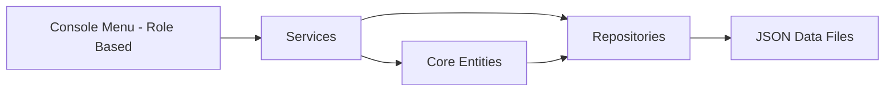

# Airline Reservation and Management System

A C++ console application for airline operations management, covering flight scheduling, aircraft and crew assignment, bookings, payments, and a passenger loyalty program. The system is built around a layered, repository-based architecture with JSON file persistence.

<p align="left">
  
  
  
  
</p>


## Table of Contents

- [Overview](#overview)
- [Features](#features)
- [Architecture](#architecture)
- [Project Structure](#project-structure)
- [How to Run](#how-to-run)
- [Key Concepts](#key-concepts)
- [Author](#author)


## Overview

The system models the core operations of an airline: managing flights and the aircraft assigned to them, assigning and tracking crew, handling passenger bookings and payments, and maintaining loyalty accounts. Three user roles drive the application's permissions and menus: Administrator, Booking Agent, and Passenger.

Each domain entity (flights, aircraft, reservations, payments, crew, users) is backed by its own repository, which loads from and persists to a dedicated JSON file. Business rules — fare calculation, seat availability, crew flight-hour limits, loyalty point accrual — are encapsulated in dedicated service classes, separating logic from data access and from the console interaction layer.


## Features

- Role-based menus for Administrator, Booking Agent, and Passenger
- Flight management: creation, scheduling, updates, and status changes
- Aircraft management with seat layout and maintenance record tracking
- Crew management with role-based assignment and flight-hour limit enforcement
- Booking workflow: search flights, reserve seats, process payments, check in
- Passenger loyalty program with point accrual tied to completed flights
- Reporting service for operational summaries
- JSON-backed persistence with no external database dependency
  


## Architecture

The codebase is organized into four logical layers:

- **Core entities** (`include/core`, `src/core`) — `Flight`, `Aircraft`, `Seat`, `SeatLayout`, `LoyaltyAccount`, `MaintenanceRecord`
- **Users and crew** (`include/users`, `include/crew`) — `Admin`, `BookingAgent`, `Passenger`, `Pilot`, `FlightAttendant`, `CrewAssignment`
- **Booking domain** (`include/booking`) — `Reservation`, `Payment`, `BoardingPass`
- **Repositories and services** (`include/repositories`, `include/services`) — JSON-backed data access and business logic: `FlightService`, `BookingService`, `PaymentService`, `CrewMember` assignment rules, `LoyaltyService`, `MaintenanceService`, `CheckInService`, `ReportService`, `AuthenticationService`



## Project Structure

```
AirlineSystem/
├── include/
│   ├── core/             # Flight, Aircraft, Seat, LoyaltyAccount, MaintenanceRecord
│   ├── users/             # Admin, BookingAgent, Passenger, User
│   ├── crew/              # Pilot, FlightAttendant, CrewAssignment
│   ├── booking/           # Reservation, Payment, BoardingPass
│   ├── repositories/       # JSON-backed repositories per entity
│   └── services/          # Business logic services
├── src/                   # Implementation files mirroring include/
├── data/                  # JSON data files (flights, aircraft, crew, users,
│                           # reservations, payments)
├── third_party/           # nlohmann::json, picosha2
└── main.cpp                # Console entry point and role-based menu loop
```


## How to Run

**Requirements**

- A C++17 compiler (GCC, Clang, or MSVC)

**Build**

```bash
g++ -std=c++17 -Iinclude -Ithird_party src/**/*.cpp main.cpp -o AirlineSystem
```

**Run**

```bash
./AirlineSystem
```

The application starts at a login/role-selection prompt. Use the in-menu registration option to create an Administrator, Booking Agent, or Passenger account.


## Key Concepts

- Object-oriented design: encapsulation, inheritance, and polymorphism across user roles and crew types
- Repository pattern for JSON-backed persistence, decoupled from business logic
- Service layer encapsulating business rules (fare calculation, seat availability, crew flight-hour limits, loyalty accrual)
- File-based data persistence with no external database dependency


## Author

Adham — GitHub: [adham19999](https://github.com/adham19999)
